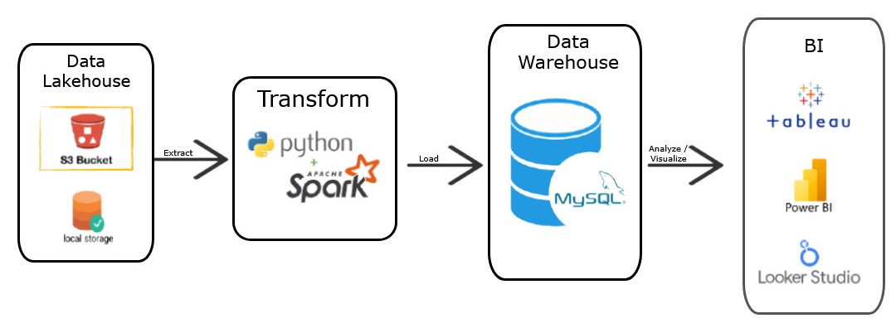

# ETL Pipeline: AWS S3 → PySpark → MySQL → Power BI

## 📌 Project Overview

This project is an implementation of an **ETL (Extract – Transform – Load)** pipeline that retrieves data from **AWS S3 (Data Lakehouse)**, processes it using **PySpark**, and loads the results into **MySQL (Data Warehouse)**. The warehouse is then connected to **Power BI** for real-time visualization.

The goal of this project is to simulate a real-world **Data Engineering** workflow.

---

## 🛠 Tech Stack

* **Storage**: AWS S3
* **Processing**: Python, Pandas, PySpark
* **Database**: MySQL
* **Orchestration**: Custom script (`main.py`)
* **Visualization**: Power BI
* **Deployment Ready**: Docker, Logging, Environment Variables

---

## 📂 Project Structure

```
etl-pipeline-s3-mysql/
├── src/                      
│   ├── __init__.py
│   ├── extract.py        # Extract from AWS S3
│   ├── transform.py      # Clean & transform (PySpark)
│   ├── load.py           # Load into MySQL
│   └── utils.py          # Logger & env loader
│
├── main.py               # Entry point (ETL orchestrator)
├── .env.example          # Template environment variables
├── logs/                 # ETL pipeline logs
│   └── etl.log
├── Dockerfile            # Containerization
├── requirements.txt      # Dependency list
├── README.md             # Project documentation
└── diagrams/             # Pipeline architecture diagram
    └── pipeline_architecture.jpg
```

---

## ⚙️ Setup & Installation

### 1. Clone Repository

```bash
git clone https://github.com/SundayBPM/End-to-End-Big-Data-Pipeline-with-PySpark.git
cd End-to-End-Big-Data-Pipeline-with-PySpark
```

### 2. Setup Virtual Environment

```bash
python -m venv .venv
source .venv/bin/activate   # Linux/Mac
.venv\Scripts\activate      # Windows
```

### 3. Install Dependencies

```bash
pip install -r requirements.txt
```

### 4. Configure Environment Variables

Copy `.env.example` into `.env` and fill in your credentials:

```ini
AWS_ACCESS_KEY_ID=your_aws_key
AWS_SECRET_ACCESS_KEY=your_secret
AWS_S3_BUCKET=your_bucket
AWS_S3_FILE_KEY=your_file.csv

MYSQL_HOST=localhost
MYSQL_USER=root
MYSQL_PASSWORD=your_password
MYSQL_DB=etl_dw
```

---

## ▶️ Running the Pipeline

Run the ETL pipeline with:

```bash
python main.py
```

Logs will be stored in:

```
logs/etl.log
```

---

## 📊 Visualization

Once the data is successfully loaded into MySQL, connect **Power BI** to the database for real-time dashboards.
Example architecture:



---

## 🚀 Deployment with Docker

Build the Docker image:

```bash
docker build -t etl-pipeline .
```

Run the container:

```bash
docker run --env-file .env etl-pipeline
```

---

## ✅ Future Improvements

* Add **unit tests** (pytest) for data transformation
* Integrate with **Airflow / Prefect / AWS EventBridge** for scheduling
* Enhance data cleaning and validation steps

---

✍️ **Author**: Sunday B. Putera Mandiri

---